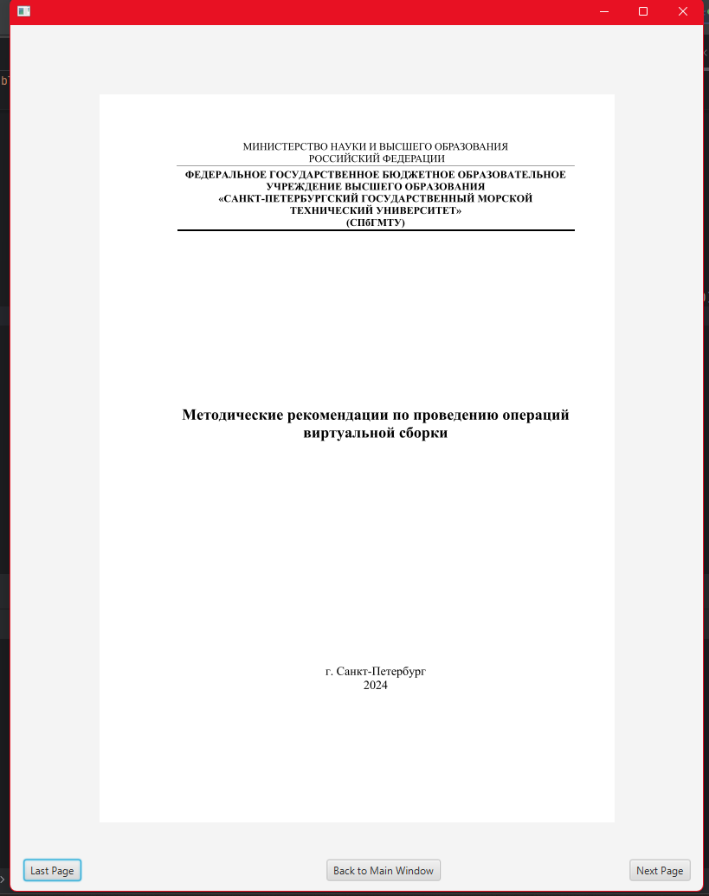

## Десктопное приложение для постраничного просмотра pdf-файлов
### Директория расположения документов 
Путь директории - src/main/resources/com/nuketree3/example/testpdfdes/documents

Можно задать путь директории в классе FileRead

### GUI 
#### Основное окно

#### Окно просмотра
